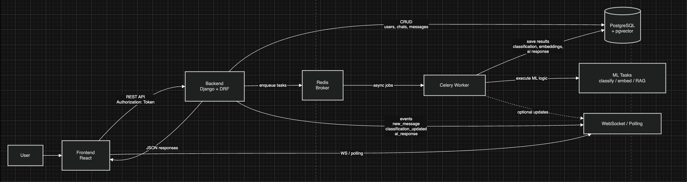
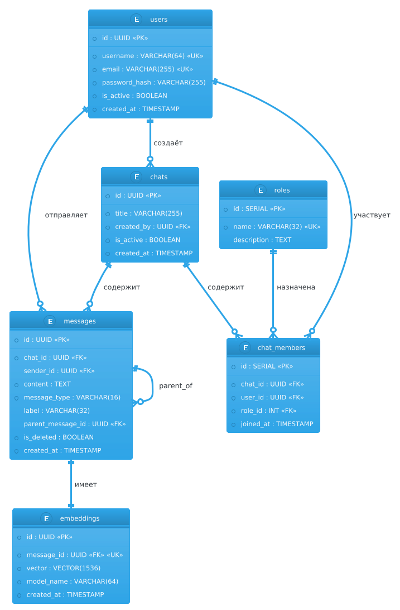
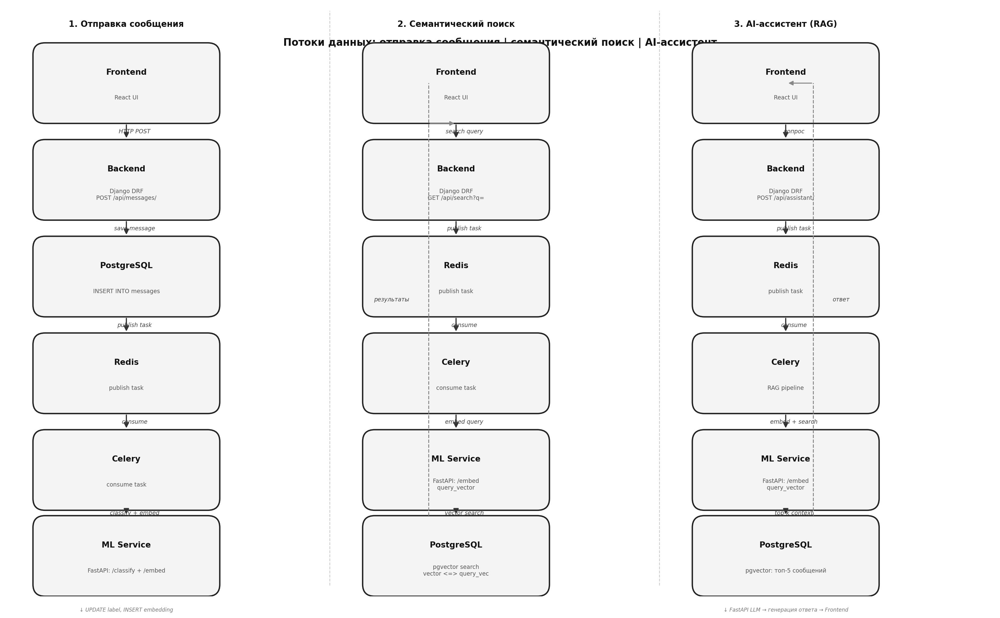

# AI Chat — Проектирование модели системы (MVP)

## Обзор системы

Проект представляет собой интеллектуальный мессенджер с ML-функциями: классификацией сообщений, семантическим поиском и AI-ассистентом. Архитектура состоит из четырёх основных частей: **Frontend (React)**, **Backend (Django + DRF)**, **асинхронная обработка ML-задач через Celery + Redis**, **Database (PostgreSQL)**. Все тяжёлые ML-операции выполняются в фоне, чтобы не блокировать пользовательский интерфейс и не замедлять API.

---

## 1. Технологический стек

| Компонент | Технология | Ответственность |
|---|---|---|
| **Frontend** | React | UI чата, формы авторизации, список чатов, сообщения, AI-функции |
| **Backend** | Django + DRF | REST API, авторизация, управление чатами и сообщениями, бизнес-логика |
| **Celery** | Celery | Асинхронное выполнение ML-задач: классификация, поиск, AI-ответы |
| **Redis** | Redis 7+ | Брокер задач для Celery |
| **Database** | PostgreSQL 15 | Хранение пользователей, чатов, сообщений, участников и результатов ML |
| **Docker** | Docker / Docker Compose | Локальный запуск всех сервисов |

Ключевое архитектурное решение: Backend не выполняет ML-обработку синхронно. Он сохраняет сообщение в БД и отправляет задачу в Celery через Redis, после чего Celery выполняет классификацию и сохраняет результат обратно в PostgreSQL.

---

## 2. Архитектурная схема



---

## 3. Модель данных

### 3.1 Сущности и атрибуты

#### `User` — Пользователь

| Атрибут | Тип | Ограничения | Описание |
|---|---|---|---|
| `id` | UUID | PK | Идентификатор |
| `username` | VARCHAR(64) | UNIQUE, NOT NULL | Логин |
| `email` | VARCHAR(255) | UNIQUE, NOT NULL | Email |
| `password_hash` | VARCHAR(255) | NOT NULL | Хэш пароля |
| `is_active` | BOOLEAN | DEFAULT TRUE | Статус аккаунта |
| `created_at` | TIMESTAMP | DEFAULT NOW() | Дата регистрации |
| `updated_at` | TIMESTAMP | DEFAULT NOW() | Дата обновления |

#### `Role` — Роль участника в чате

| Атрибут | Тип | Ограничения | Описание |
|---|---|---|---|
| `id` | SERIAL | PK | Идентификатор |
| `name` | VARCHAR(32) | UNIQUE, NOT NULL | `owner`, `admin`, `member`, `guest` |
| `description` | TEXT | NULL | Описание прав |

#### `Chat` — Чат / комната

| Атрибут | Тип | Ограничения | Описание |
|---|---|---|---|
| `id` | UUID | PK | Идентификатор чата |
| `title` | VARCHAR(255) | NOT NULL | Название |
| `created_by` | UUID | FK → users.id | Создатель |
| `is_active` | BOOLEAN | DEFAULT TRUE | Активность |
| `created_at` | TIMESTAMP | DEFAULT NOW() | Дата создания |
| `updated_at` | TIMESTAMP | DEFAULT NOW() | Дата обновления |

#### `ChatMember` — Участник чата

| Атрибут | Тип | Ограничения | Описание |
|---|---|---|---|
| `id` | SERIAL | PK | Идентификатор |
| `chat_id` | UUID | FK → chats.id | Чат |
| `user_id` | UUID | FK → users.id | Пользователь |
| `role_id` | INT | FK → roles.id | Роль в чате |
| `joined_at` | TIMESTAMP | DEFAULT NOW() | Дата вступления |

Составной уникальный ключ: `UNIQUE(chat_id, user_id)`.

#### `Message` — Сообщение

| Атрибут | Тип | Ограничения | Описание |
|---|---|---|---|
| `id` | UUID | PK | Идентификатор |
| `chat_id` | UUID | FK → chats.id | Чат |
| `sender_id` | UUID | FK → users.id, NULL | Отправитель (NULL для AI) |
| `content` | TEXT | NOT NULL | Текст сообщения |
| `message_type` | VARCHAR(16) | CHECK IN (`user`, `assistant`, `system`) | Тип сообщения |
| `label` | VARCHAR(32) | NULLABLE | ML-метка: `question`, `task`, `statement`, `offtopic` |
| `parent_message_id` | UUID | FK → messages.id, NULL | Ответ на сообщение |
| `is_deleted` | BOOLEAN | DEFAULT FALSE | Мягкое удаление |
| `created_at` | TIMESTAMP | DEFAULT NOW() | Дата создания |
| `updated_at` | TIMESTAMP | DEFAULT NOW() | Дата обновления |

Поле `label` заполняется асинхронно после классификации сообщения.

#### `Embedding` — Векторное представление

| Атрибут | Тип | Ограничения | Описание |
|---|---|---|---|
| `id` | UUID | PK | Идентификатор |
| `message_id` | UUID | FK → messages.id, UNIQUE | Связь 1:1 |
| `vector` | VECTOR(1536) | NOT NULL | Вектор (pgvector) |
| `model_name` | VARCHAR(64) | NOT NULL | Название модели |
| `created_at` | TIMESTAMP | DEFAULT NOW() | Дата создания |

---

## 4. ER-диаграмма




## 5. Потоки данных



### 5.1 Отправка сообщения

```text
[Видимый поток — синхронный]
1. Frontend  → POST /api/messages/ (content, chat_id)
2. Backend   → Проверка токена и членства в чате
3. Backend   → INSERT INTO messages (chat_id, sender_id, content)
4. Backend   ← 201 Created {message_id}
5. Backend   → Событие в real-time слой или polling-обновление

[Скрытый ML-поток — асинхронный]
6. Backend   → Redis: задача classify+embed(message_id)
7. Celery    ← получает задачу
8. Celery    → выполняет классификацию
9. Celery    → формирует embedding
10. Celery   → UPDATE messages SET label=...
11. Celery   → INSERT INTO embeddings (message_id, vector)
```

### 5.2 Семантический поиск

```text
1. Frontend  → GET /api/search?q=...&chat_id=...
2. Backend   → Redis: task search(query, chat_id)
3. Celery    ← consume task
4. Celery    → получает embedding запроса
5. Celery    → PostgreSQL pgvector search
6. Backend   ← 200 OK [{message, label, similarity_score}]
7. Frontend  → отображает релевантные сообщения
```

### 5.3 AI-ассистент

```text
1. Frontend  → POST /api/assistant/ {question: "..."}
2. Backend   → Redis: task generate_response(question, chat_id)
3. Backend   ← 202 Accepted {task_id}

4. Celery    → embedding вопроса
5. Celery    → поиск топ-N сообщений по схожести
6. Celery    → формирование prompt
7. Celery    → генерация ответа
8. Celery    → INSERT INTO messages (message_type='assistant', content=response)
9. Celery    → INSERT INTO embeddings
10. Backend  → уведомление фронта
```

---

## 6. API-спецификация

### Backend (Django + DRF)

| Метод | Эндпоинт | Описание |
|---|---|---|
| POST | `/api/auth/token/` | Авторизация, получение токена |
| POST | `/api/auth/register/` | Регистрация пользователя |
| GET | `/api/me/` | Профиль текущего пользователя |
| GET | `/api/chats/` | Список чатов пользователя |
| POST | `/api/chats/` | Создать чат |
| GET | `/api/messages/?chat=` | История сообщений с пагинацией |
| POST | `/api/messages/` | Отправить сообщение |
| GET | `/api/chats/{id}/members/` | Участники чата |
| POST | `/api/search/` | Семантический поиск |
| POST | `/api/assistant/` | Запрос к AI-ассистенту |
| WS | `/ws/chats/{id}/` | Real-time события |

### ML-задачи через Celery

Так как отдельный FastAPI ML Service убран, ML-логика выполняется в фоне через Celery-задачи:
- `classify_message`
- `generate_embedding`
- `generate_ai_response`
- `search_messages`

---

## 7. ML-поведение

- Классификация сообщения запускается после сохранения сообщения.
- Если `confidence` низкая, метка может не сохраняться.
- Эмбеддинг создаётся отдельно и сохраняется в таблицу `embeddings`.
- AI-ассистент использует RAG: сначала поиск контекста, затем генерация ответа.
- Все ML-задачи выполняются асинхронно через Celery, чтобы UI не зависал.

---
